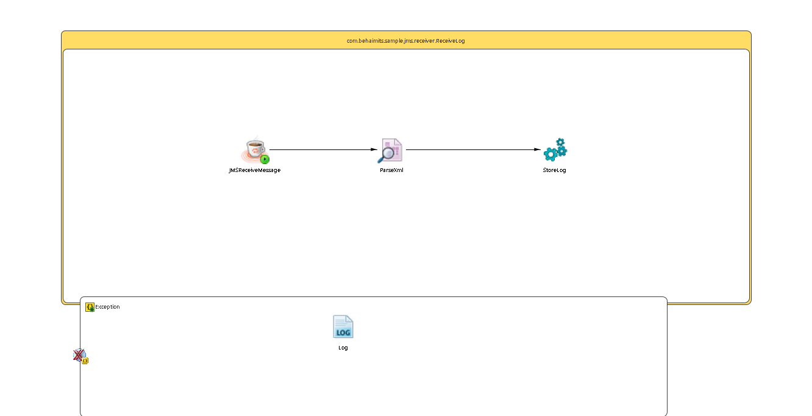

# ReceiveLog {#ProcessMain .concept}

License for TIBCO Software Use Only!

Section contains description of Process " ReceiveLog.bwp " .

**Parent topic:**[Processes](../../../../../../../../projects/com.behaimits.sample.http.requestor/common/process.md)

## Folder description: {#FolderDescription}

|Folder|Description|
|------|-----------|
| |No description|

## Process description: {#ProcessDescription}

|No description|

## Process definition: {#ProcessDefinition}

Full process path: com.behaimits.sample.jms.receiver.ReceiveLog

## Diagram: {#Diagram}



## Process starter activity: {#Starter}

### Name: ***JMSReceiveMessage*** {#JMSReceiveMessage}

-   Messaging Style: Queue
-   JMS Connection: [EMS\_CONNECTOR](#default:%20com.behaimits.sample.http.requestor.JMSConnectionResource,%20UnixProfile:%20com.behaimits.sample.http.requestor.JMSConnectionResource,%20WindowsProfile:%20com.behaimits.sample.http.requestor.JMSConnectionResource,)
-   Destination: [LOGGING\_QUEUE](#default:%20com.behaimits.sample.http.requestor.logging,%20UnixProfile:%20com.behaimits.sample.http.requestor.logging,%20WindowsProfile:%20com.behaimits.sample.http.requestor.logging,)
-   Message Type: Text
-   Subscription Name:
-   Supress local Messages: false
-   Acknowledge Mode: Auto
-   Message Selector:
-   Polling Interval\(sec\): 2
-   Create Instance: yes
-   Description:

## Process properties and variables {#ProcessVariables}

|Name|Type|Property Source|Default Value|
|----|----|---------------|-------------|
|\_processContext| | | |
|jmsConnection|xsd:string|EMS\_CONNECTOR| |
|JMSReceiveMessage| | | |
|LOGGING\_QUEUE|xsd:string|LOGGING\_QUEUE| |
|StoreLog-input| | | |
|ParseXml-input| | | |
|ParseXml| | | |
|\_error\_ParseXml| | | |
|FaultName|xsd:string| | |
|FaultDetails| | | |
|Log-input| | | |

## Activities: {#Activities}

### Name: ***Log*** {#Log}

-   Description: *No description*
-   Type: bw.generalactivities.log
-   Logger Name:
-   Log level: *Info*
-   Suppress Job Info: *true*
-   Input Variable: *Log-input*
-   *Input bindings:*
    -   Mapping table

        |Target|Source|
        |------|------|
        |*/tns:ActivityInput/msgCode*|**\$FaultDetails/MsgCode**|
        |*/tns:ActivityInput/logLevel*|**"Error"**|
        |*/tns:ActivityInput/message*|**\$FaultDetails/Msg**|

    -   Mapping tree

        ```
        tns:ActivityInputmsgCode = $FaultDetails/MsgCodelogLevel = &quot;Error&quot;message = $FaultDetails/Msg
        ```

    -   Source code

        ```
        <?xml version="1.0" encoding="UTF-8"?>
        <xsl:stylesheet xmlns:xsl="http://www.w3.org/1999/XSL/Transform" xmlns:tns="http://www.tibco.com/pe/WriteToLogActivitySchema" version="2.0"><xsl:param name="FaultDetails"/><xsl:template name="Log-input" match="/"><tns:ActivityInput><msgCode><xsl:value-of select="$FaultDetails/MsgCode"/></msgCode><logLevel><xsl:value-of select="&quot;Error&quot;"/></logLevel><message><xsl:value-of select="$FaultDetails/Msg"/></message></tns:ActivityInput></xsl:template></xsl:stylesheet>
        ```


### Name: ***ParseXml*** {#ParseXml}

-   Description: *No description*
-   Type: bw.xml.parsexml
-   Input Style: *text*
-   Input Variable: *ParseXml-input*
-   Output Variable: *ParseXml*
-   *Input bindings:*
    -   Mapping table

        |Target|Source|
        |------|------|
        |*/tns4:xmlString*|**\$JMSReceiveMessage/Body**|

    -   Mapping tree

        ```
        tns4:xmlString = $JMSReceiveMessage/Body
        ```

    -   Source code

        ```
        <?xml version="1.0" encoding="UTF-8"?>
        <xsl:stylesheet xmlns:xsl="http://www.w3.org/1999/XSL/Transform" xmlns:tns4="http://www.tibco.com/namespaces/tnt/plugins/parsexml" version="2.0"><xsl:param name="JMSReceiveMessage"/><xsl:template name="ParseXml-input" match="/"><tns4:xmlString><xsl:value-of select="$JMSReceiveMessage/Body"/></tns4:xmlString></xsl:template></xsl:stylesheet>
        ```


### Name: ***StoreLog*** {#StoreLog}

-   Description: *No description*
-   Input Variable: *StoreLog-input*
-   *Input bindings:*
    -   Mapping table

        |Target|Source|
        |------|------|
        |**|/\[COPY-OF\] **\$ParseXml**|

    -   Mapping tree

        ```
         = 
        ```

    -   Source code

        ```
        <?xml version="1.0" encoding="UTF-8"?>
        <xsl:stylesheet xmlns:xsl="http://www.w3.org/1999/XSL/Transform" version="2.0"><xsl:param name="ParseXml"/><xsl:template name="StoreLog-input" match="/"><xsl:copy-of select="$ParseXml"/></xsl:template></xsl:stylesheet>
        ```

-   Spawn: *false*
-   Subprocess: [com.behaimits.sample.http.requestor/Processes/com/behaimits/sample/db/store/WriteLog.bwp](../../db/store/WriteLog.bwp.md)

## Transitions: {#Transitions}

-   From: ***JMSReceiveMessage*** -To: ***ParseXml***
    -   Label: **
    -   Type: SUCCESS

-   From: ***ParseXml*** -To: ***StoreLog***
    -   Label: **
    -   Type: SUCCESS

