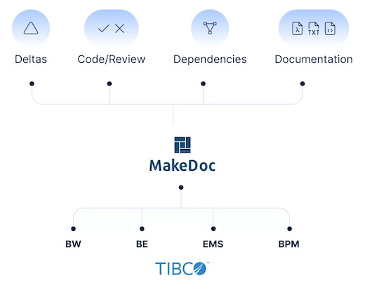

# MakeDoc for TIBCO

MakeDoc® provides automatic code review and analysis of TIBCO projects. With a single click, the tool generates technical documentation for your ActiveMatrix BusinessWorks®, EMS server, and other projects or deployments. Based on this analysis, MakeDoc® performs automated code reviews, highlights differences between TIBCO environments or project versions over time, and visually displays dependencies across an unlimited number of TIBCO projects.

## MakeDoc Story

The story of MakeDoc began back in 2007, when our TIBCO consultants needed a fast way to understand complex customer environments. Over time, we added several smart features, transforming a simple internal tool into a mature documentation solution highly valued by our clients.  
MakeDoc was born from real-world experience and built to address the everyday needs of TIBCO consultants.

## Benefits

- Always up-to-date documentation of your environment (time-saving)
- Faster onboarding and training of new TIBCO developers
- Improved code quality (TIBCO-specific)
- Easier error localization and troubleshooting
- Continuous, high-level overview of the development process

## Samples

This Developer Hub plugin aims to introduce MakeDoc and demonstrate its capabilities in a nutshell, while also providing information about the company behind the product.

1. **Introduction** – This section gives a brief overview of MakeDoc and contact details.
2. **User Manual** – The second part provides usage instructions and guidelines.
3. **Sample Outputs** – The last section showcases automatically generated documentation samples for BW5, BW6/CE, and EMS projects.

# About Us

Behaim ITS is an IT consulting company specializing in TIBCO infrastructure technologies (Integrations, Messaging, Adapters, BPM, MDM, Dashboards & Analytics, Order-Fulfillment, CEP, and more).

## Verticals

Telecommunications, Utilities / Oil & Gas, Life Sciences, Healthcare, Manufacturing, Finance & Banking, Logistics.

## Experience

Our company is built on senior consultants with an average of 15 years of hands-on consulting experience.

## Where We Operate

We serve clients across EMEA and North America. Our headquarters and main development center are in Olomouc, Czech Republic, with additional development branches in Chicago, IL, USA.

## Contact Us

Visit our website: [https://behaimits.com](https://behaimits.com)  
Follow us on [LinkedIn](https://www.linkedin.com/company/behaim-it-solutions)  
Email us: **contact_us@behaimits.com** – we’ll be happy to answer your questions or arrange a live MakeDoc demo.  

For license inquiries, please contact **license@makedoc.com**.
