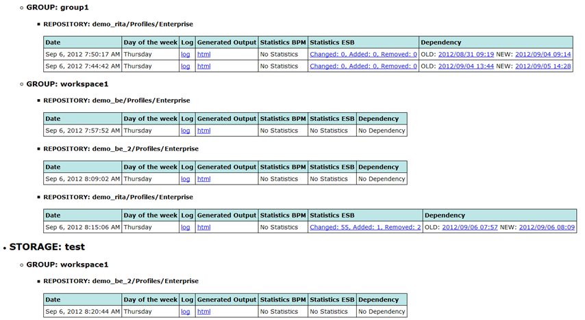

# Generated Output {#BaseModule .concept}

Portal generates a HTML output and describe your MakeDoc Storage environment. It also provides easy way how to get MakeDoc outputs. Portal has 2 basic layouts:

-   **Single page layout** - all storages are displayed at one page as a list of storages.
-   **Multi page layout** - storages are displayed as a list of links to separated pages on the main page.

Every record in table has 6 columns and represents output of one generation process.

-   **Date** - date of the generation process.
-   **Day of week** - which day of the week.
-   **Generated output** - set of the formats \(HTML, PDF, DOCX\), that was generated and they are displayed like a direct links to these outputs.
-   **Statistics BPM** - this column contains statistics when generated output of BPM is Repository Analytics type. Displays counts of added, changed, removed items of the projects as links to the RA outputs.
-   **Statistics ESB** - this column contains statistics when generated output of ESB is Repository Analytics type. Displays counts of added, changed, removed items of the projects as links to the RA outputs.
-   **Dependency** - contains compared snapshots \(OLD and NEW\), when generated output is Repository Analytics type.

**Parent topic:**[Portal](../../../../modules/base/portal/index.md)

