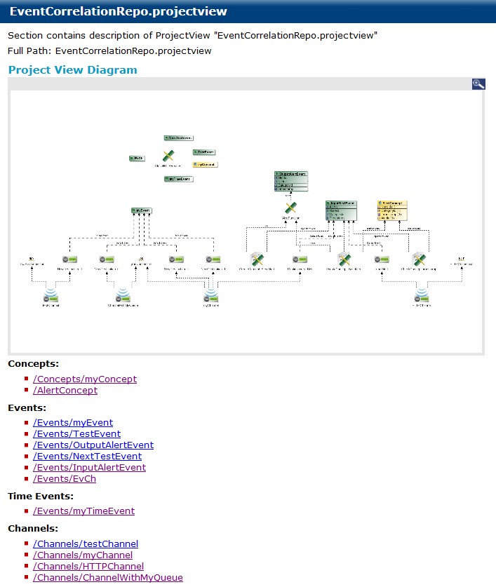

# Project Views {#projectViews .concept}

Project View documentation consists of Project View Diagram and list of Items showed on Project View Diagram with link to documentation item.

**Parent topic:**[Project Documentation](../../../modules/bebe/output/ProjectDocumentation.md)

