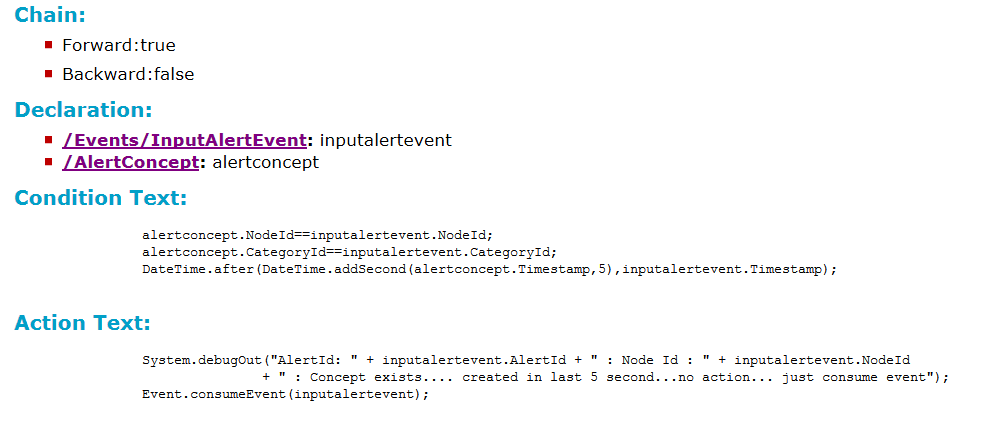

# Rules {#rules .concept}

Rule documentation consists of Rule Description, Dependency Diagram, Sequence Diagram, Priority, Chain, Declaration, Condition Text, Action Text.

**Parent topic:**[Project Documentation](../../../modules/bebe/output/ProjectDocumentation.md)

