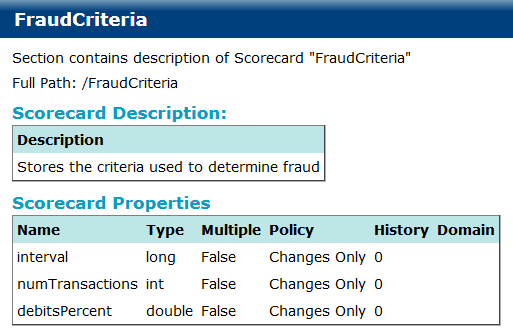

# Scorecards {#scorecard .concept}

Scorecard documentation consists of Scorecard Description and Properties.

**Parent topic:**[Project Documentation](../../../modules/bebe/output/ProjectDocumentation.md)

