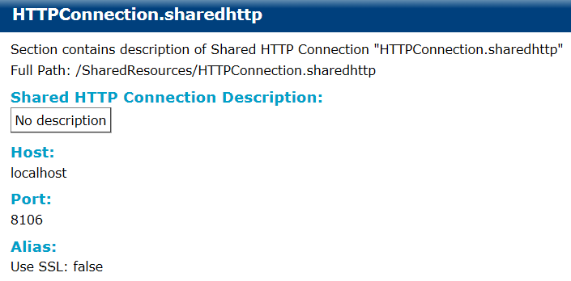

# Shared HTTP Connection {#sharedHTTPConnection .concept}

Shared HTTP Connection documentation consists of Shared HTTP Connection Description, Host, Port and Alias.

**Parent topic:**[Project Documentation](../../../modules/bebe/output/ProjectDocumentation.md)

