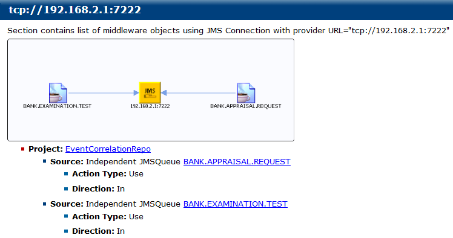

# User Defined CrossReference {#userDefCross .concept}

The section User Defined CrossReference is special part of generated documentation. This part contains documentation of JMS Connections and their usages by JMS Queue.

Content of User Defined CrossReference is driven by special files stored in BusinessEvents Module project in folder Templates/cross/def/\*. By editing or adding new files can be automatically added new part of documentation. Adding and editing needs good knowledge of TIBCO BusinessEvents Module processing. **Editing and adding new files is NOT RECOMMENDED**. User Defined CrossReference is new model and it will be improved and accessible to users in future.

**Parent topic:**[Cross-Reference Documentation](../../../modules/bebe/output/CrossReferenceDocumentation.md)

