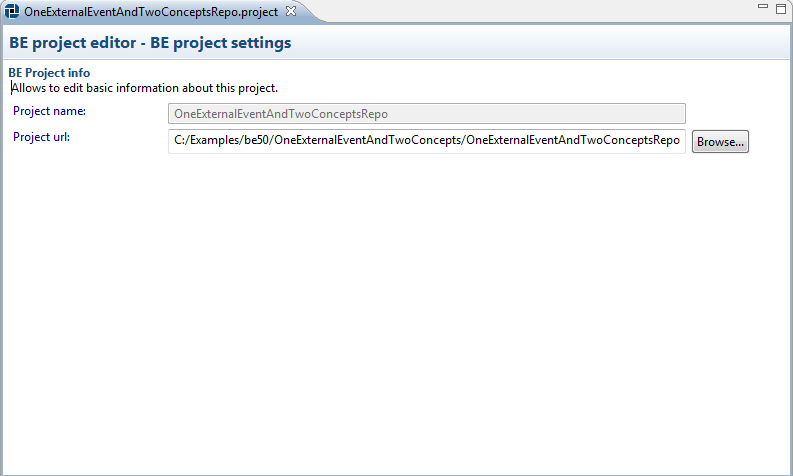
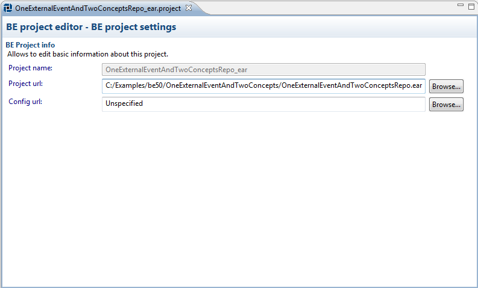

# Editing BusinessEvents project {#editingBEProject .concept}

Existing BusinessEvents projects can be modified by BusinessEvents Project Editor. Editor allows change path to TIBCO BusinessEvents source directory or EAR and EAR configuration file.

**Parent topic:**[Working with TIBCO BusinessEvents projects](../../../../modules/bebe/setup/dialogs/workingWithBEProject.md)

