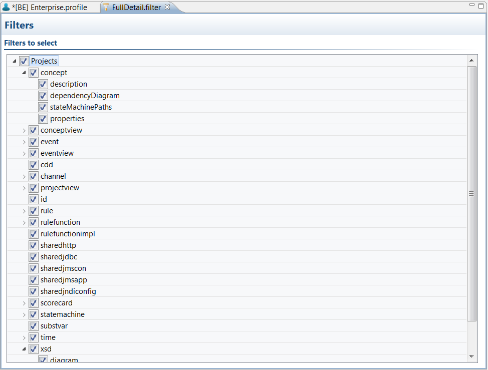

# Editing filters {#editingFilters .concept}

Existing filters can be modified by BusinessEvents Filter Editor. Filter allows reduce generated documentation by selecting parts showed in BusinessEvents Filter Editor.

Filter contains three parts. Projects, CrossReference and QualityAssurance. By deselecting parts is possible reduce generated documentation.

**Parent topic:**[Working with Filters](../../../../modules/bebe/setup/dialogs/workingWithFilters.md)

