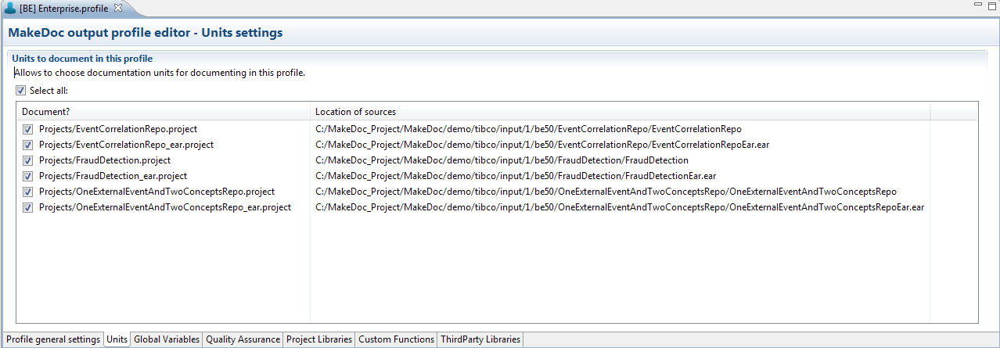
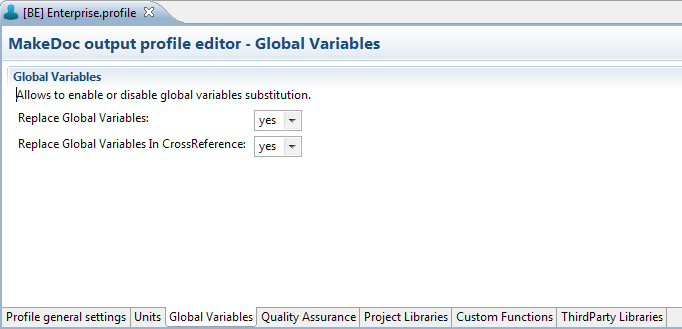

# Editing BusinessEvents Profiles {#editingBEProfile .concept}

Existing BusinessEvents Profiles can be modified by BusinessEvents Profile Editor. Double click on BusinessEvents Profile opens BusinessEvents Profile Editor.

BusinessEvents Profile Editor contains seven bookmarks.

First bookmark Profile general settings allows set Profile name, which is showed in generated documentation name. Profile author says who creates Profile. Project description contains short information about Profile.

Output settings allow to set properties of generation process such as output formats to generate, paper format, filter and two checkboxes for fast selecting all Units and Quality Assurance Rules to document.

Last Storage settings allow to set storage properties as Storage and Repository location.

Button Generate documentation starts documentation process.

Button Show Repository select las generated snapshot of this profile in MakeDocStorage.

BusinessEvents Profile has selected all Units to document in default. Unit means BusinessEvents Project. Second bookmark Units provides selection of Units to document and shows all Units which are stored in Profile's BusinessEvents Module project. All Units can be selected automatically by checkbox Select all.

Global Variables are variables used in BE project. It means you can change variable on one place. Thanks to this are changes distribuated to all places where Global Variables are used. In this bookmark you can select if you allow to enable or disable Global Variables substitution.\(Project, Crossreference\)

BusinessEvents Profile has not selected Quality Assurance Rules to document in default. Last bookmark Quality Assurance provides selection of Rules to apply on sources and shows all Rules which are stored in Profile's BusinessEvents Module project. All Rules can be selected automatically by checkbox Select all.

Next bookmark Custom Functions provides selection of Custom Functions \(\*.jars\) to allow to choose Custom Function and associate it with projects for documenting in this profile. All Custom Functions can be selected automatically by checkbox Select all.

Project Libraries bookmark provides selection of Project Libraries \(\*.projlib\) to allow to choose Project Libraries and associate it with projects for documenting in this profile. All Project Libraries can be selected automatically by checkbox Select all.

Last bookmark Third Party Libraries provides selection of Third Party Libraries \(\*.jar\) to allow to choose Third Party Libraries and associate it with projects for documenting in this profile. All Third Party Libraries can be selected automatically by checkbox Select all.

**Parent topic:**[Working with Profiles](../../../../modules/bebe/setup/dialogs/workingWithProfile.md)

