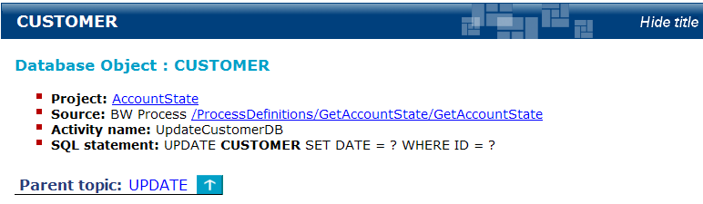

# Database Objects {#crossRefDestinations .concept}

The Database Objects section of the document gives overview of relations among Projects and Database objects. It identifies which database object \(table, view, stored procedure\) is used by specific Project \(and process\) and vice versa. It contains two subsections.

**Database Object Reference** contains all database objects, that are somehow used by documented TIBCO projects, grouped by connection string and SQL action which is performed on such object \(SELECT, UPDATE, INSERT, DELETE, CALL\).

**Project Reference** is a list of projects. For each project a list of referenced database objects is presented.

**Parent topic:**[Cross-Reference Documentation](../../../modules/falcon/output/crossRefDoc.md)

