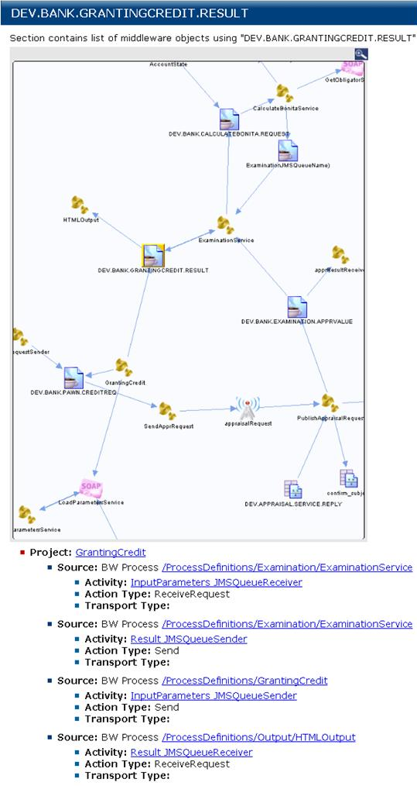
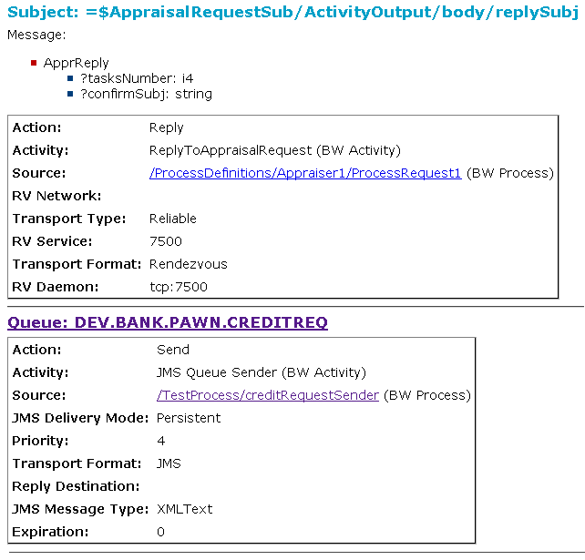

# Destinations {#crossRefDestinations .concept}

The Destinations section of the document references information of all projects in the MakeDoc for TIBCO solution. It contains two sub sections.

The first section is a list of all the process destinations. This is a list of all process inputs and outputs from or to a unique JMS queue, SOAP, Business event or Rendezvous message and JDBC Connections. The project, process and activity using the message are hyper-linked.

Destination documentation contains the visual cross-reference where the user can see near destination neighborhood. Actually opened destination has yellow border for simpler orientation in the diagram. Every diagram element is hyper-linked to its documentation page.

The second section is a list of projects and the destinations accessed by the project. A summary list of the messages used by the process is presented. Then for each item in this list a detail description of the message is presented.

**Parent topic:**[Cross-Reference Documentation](../../../modules/falcon/output/crossRefDoc.md)

