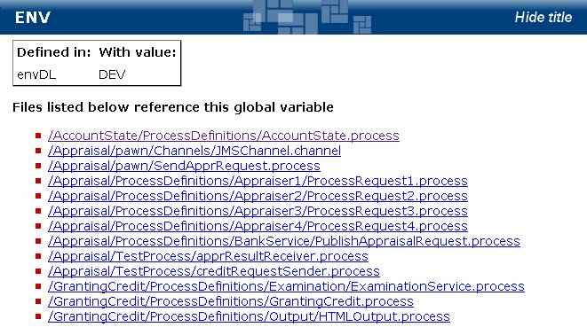

# Global Variables {#crossRefGlobalVariables .concept}

The Global Variables section of the document references information of all projects in the MakeDoc for TIBCO solution. It contains two subsections.

The first section **Global Variables Reference** is a list of all global variables. Global variables are structured similar to TIBCO Designer, but this structure is built among all project in the MakeDoc for TIBCO solution. Each global variable documentation contains table of its values, because global variable can be defined in more than one project. Hyper-links to referencing resources \(e.g. processes, connections\) are also included.

The second section **Projects Reference** is a list of projects. For each project a summary list of the referenced global variables is presented.

**Parent topic:**[Cross-Reference Documentation](../../../modules/falcon/output/crossRefDoc.md)

