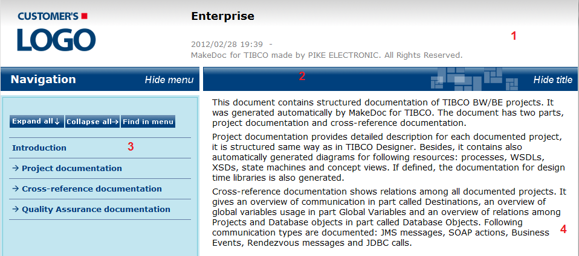

# How To Use HTML Documentation {#howToUseHTMLDocumentation .concept}

The HTML documentation is saved in "HTML" subfolder of your generated folder. HTML page consists of 4 frames.

**1. Header frame**

Header frame contains customer's logo, name of project, generated date and time.

**2. Title frame**

Title frame can be used for simple manipulation with page. One can hide Navigation frame by clicking "Hide menu" or hide Title frame by clicking "Hide title".

**3. Navigation frame**

Navigation frame contains whole menu tree. For easier navigation one can use buttons "Expand all", "Collapse all" and "Find in menu" on the top of frame.

-   Expand all - open all items in menu.
-   Collapse all - close all items in menu.
-   Find in menu - find page displayed in Main frame in menu.

**4. Main frame**

The main frame displays generated documentation.

**Parent topic:**[Generated output](../../../modules/falcon/output/index.md)

