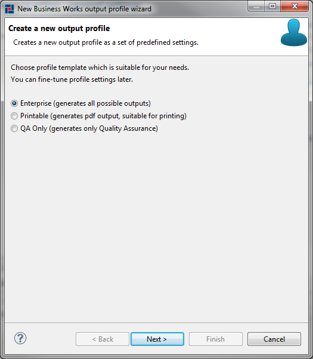
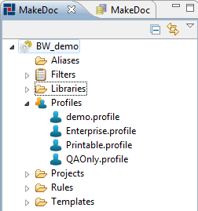
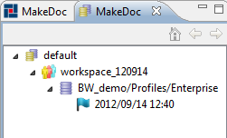

# Working with profiles {#BaseModule .concept}

At this moment we are almost ready to generate documentation of TIBCO BusinessWorks middleware. We have defined all prerequisites. Last step remains. We need to create profile. Profile is MakeDoc artifact represented by file as well as other artifacts we know already. Profile aggregates all artifacts defined in previous steps. We can say that profile defines properties of one MakeDoc for TIBCO BusinessWorks generation run and allows us to start it.

Every MakeDoc for TIBCO BusinessWorks documentation project comes with three profiles \(Enterprise.profile, Printable.profile, QAOnly.profile\). If user needs explicitly create another one there is wizard-editor pair provided to achieve this.

Right-click on Profiles folder in MakeDoc Explorer and choose New-\>BusinessWorks Profile. First page let us decide which profile template use as default configuration of our new profile. There are three options. Enterprise profile is preconfigured to generate full documentation, Printable profile is suitable for printing, QAOnly generate only Quality Assurance Documentation.

Choose Enterprise profile and click Next.

Now enter the filename for newly created profile. Profile file has extension .profile. Again no need to enter it, MakeDoc appends it automatically.

Look for this profile in project tree and open it. TIBCO BusinessWorks profile editor consists of four pages

-   Profile general settings
-   Units
-   Global Variables
-   Quality Assurance

General settings page is divided into three sections:

-   Profile info - holds basic identification information for this profile
    -   Profile name
    -   Author
    -   Description
-   Output settings - contains these settings:
    -   Output formats generated for this profile \(HTML, PDF and DOCX are supported\)
    -   Paper format \(A4 or letter\)
    -   Filters - dropdown list for choosing filter settings \(see Filters chapter\)
    -   Aliases - dropdown list for choosing aliases settings \(see Libraries and aliases chapter\)
    -   Document all units - yes/no option, if checked, all units of project are automatically documented in this profile
    -   Automatically check Quality Assurance - full QA check of units is performed in generation process
-   Storage settings - allows us to choose storage used to save generated snapshots of documentation

As aliases select from combo Aliases/aliases\_mapping.aliases. Check document all units and Automatically check Quality Assurance.

Units page determines subset of units of our documentation project. This subset is documented when user starts generation process for this profile. If Document all units option was selected in general settings, widgets on this page are disabled.

Global Variables page allows to enable or disable global variables substitution.

Quality Assurance page allows user to influence Quality Assurance check performed as a part of generation process in detail. For more informations see Quality Assurance chapter in this manual.

So BusinessWorks profile is central point of MakeDoc for TIBCO BusinessWorks project. It is possible to understand it as subset of units included in project together with other settings \(such as output formats\). These settings influences final content of documentation. Now save profile and hit 'Generate documentation' button to start generation process.

MakeDoc now goes through phases of generation process, generates:

-   project documentation for each unit from profile
-   BusinessWorks to BusinessWorks cross-reference documentation
-   Quality Assurance documentation

Generation process successfully ends with 'BUILD SUCCESSFUL' message.

Click on MakeDoc storage view \(left side of the main screen\). Right click on generated snapshot and choose HTML. We are ready now to inspect generated output in next part of the text.

**Parent topic:**[Setup](../../../modules/falcon/setup/index.md)

