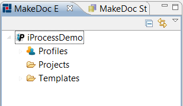

# Creating TIBCO iProcess Module Project {#creatingIPModulProject .concept}

Chapter describes creation of TIBCO iProcess Module project.

Name of project can be set in next wizard page.

MakeDoc creates main project structure after pressing Finish.

Project contains three folders:

-   Profiles - contains profiles for selecting TIBCO iProcess project to document, output format of documentation
-   Projects - contains all TIBCO iProcess projects to document
-   Templates - contains FreeMarker templates

**Parent topic:**[Dialogs](../../../../modules/nighthawk/setup/dialogs/dialogs.md)

