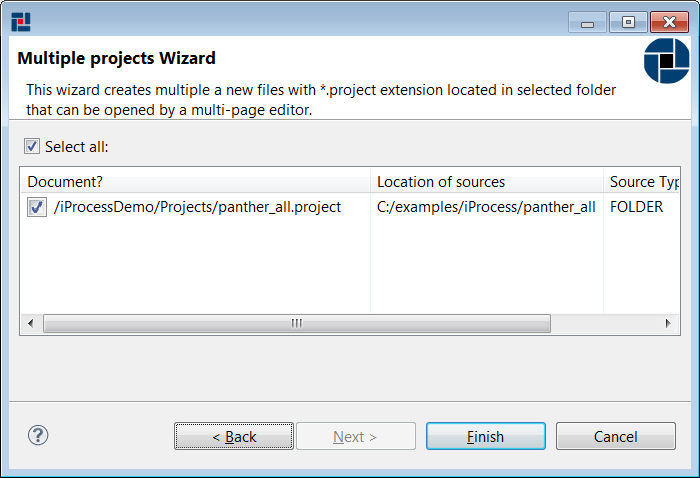
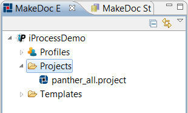

# Creating TIBCO iProcess project {#creatingIPProject .concept}

TIBCO iProcess project can be created by New Multiple iProcess Projects wizard. New Multiple iProcess wizard allows create more TIBCO iProcess projects by one step.

**Creating multiple iProcess projects**

Right click on Project folder in TIBCO iProcess Module project and select New \> iProcess Projects

New Multiple iProcess Projects wizard allows selection of desired type of source - Folders. After setting URL to directory, wizard tries to find all sources in selected folder recursively and shows all found TIBCO iProcess Projects for selecting or deselecting found projects.

**Parent topic:**[Working with TIBCO iProcess projects](../../../../modules/nighthawk/setup/dialogs/workingWithIPProject.md)

