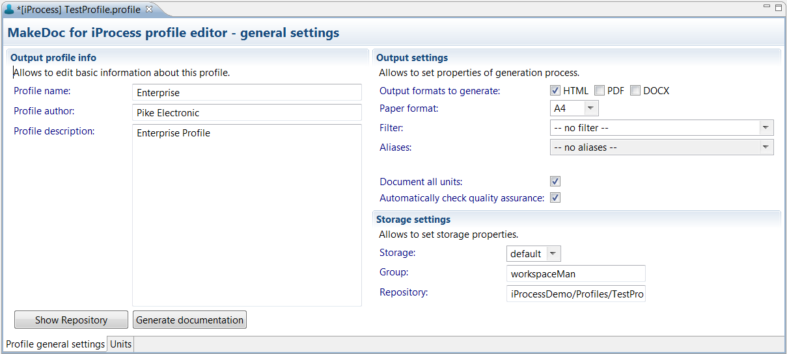

# Editing iProcess Profiles {#editingBSProfile .concept}

Existing iProcess Profiles can be modified by iProcess Profile Editor. Double click on iProcess Profile opens iProcess Profile Editor.

iProcess Profile Editor contains two bookmarks.

First bookmark Profile general settings allows to set Profile name, which is showed in generated documentation name. Profile author says who creates Profile. Project description contains short information about Profile.

Output settings allows to set properties of generation process such as output formats to generate, paper format, filter and two checkboxes for fast selecting all Units and Quality Assurance Rules to document.

Last Storage settings allow to set storage properties as Storage and Repository location.

Button Generate documentation starts documentation process.

iProcess Profile has selected All Units to document by default. Unit means iProcess Project. Second bookmark Units provides selection of Units to document and shows all Units which are stored in Profile's iProcess Module project. All Units can be selected automatically by checkbox Select all.

**Parent topic:**[Working with Profiles](../../../../modules/nighthawk/setup/dialogs/workingWithProfile.md)

