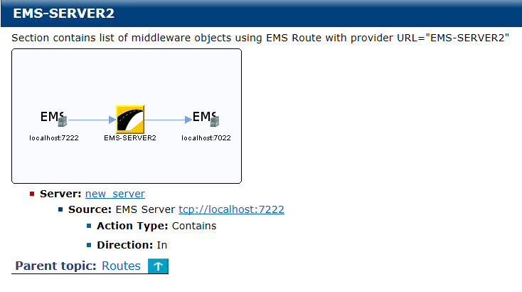

# Routes {#GVCross .concept}

The Routes section contains EMS Servers and routes between them. Hyper-links to referencing servers are included.

**Parent topic:**[Cross-Reference Documentation](../../../modules/pigeon/output/CrossReferenceDocumentation.md)

