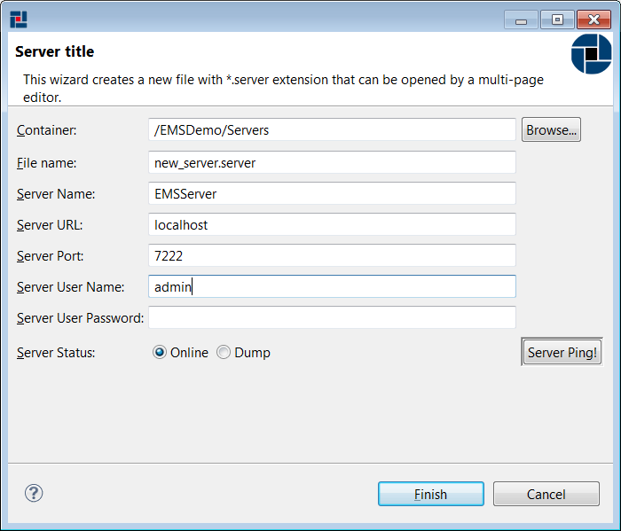
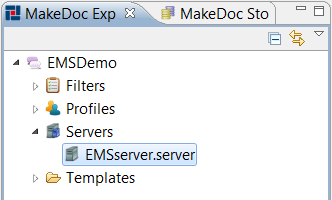

# Creating TIBCO EMS Servers {#creatingIPProject .concept}

EMS Servers can be created by EMS Servers wizard.

**Creating EMS Server**

Right click on Servers folder in TIBCO EMS Module project and select New \> EMS Server

This wizard allows you to create EMS Server object for documenting EMS Server. Server's Name, URL, Port, User and Password are required. It is necessary to fill this information correctly.

**Parent topic:**[Working with TIBCO EMS servers](../../../../modules/pigeon/setup/dialogs/workingWithEMSServer.md)

