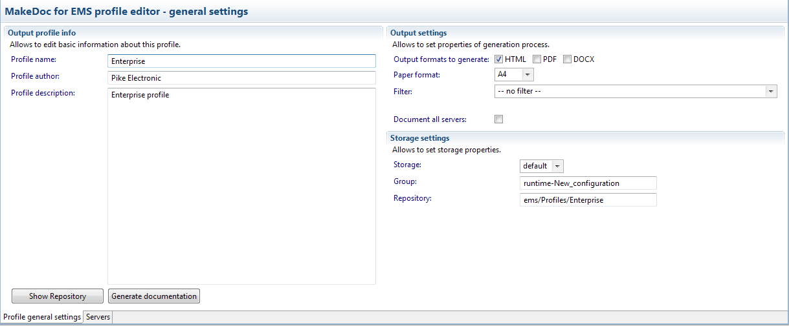
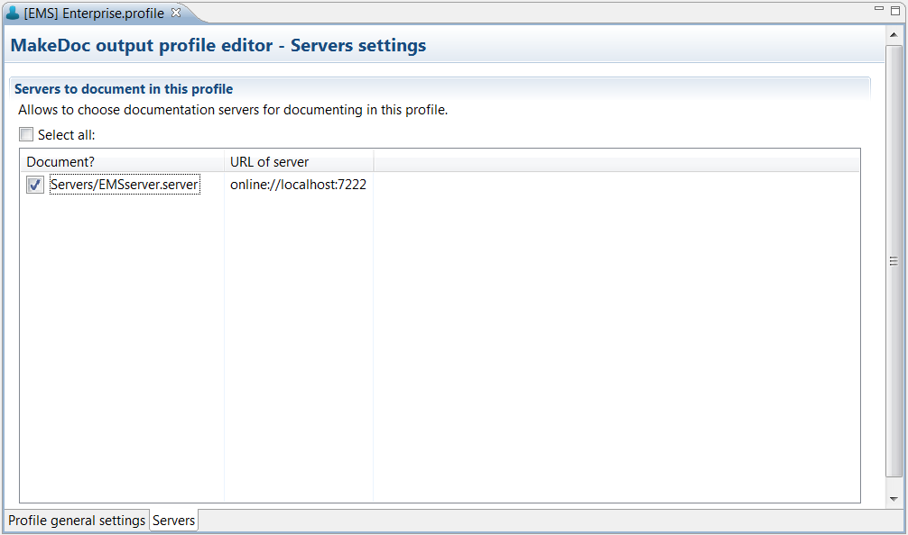

# Editing EMS Profiles {#editingBSProfile .concept}

Existing EMS Profiles can be modified by EMS Profile Editor. Double click on EMS Profile opens EMS Profile Editor.

EMS Profile Editor contains two bookmarks.

First bookmark Profile general settings allows set Profile name, which is showed in generated documentation name. Profile author says who creates Profile. Project description contains short information about Profile.

Output settings allow to set properties of generation process such as output formats to generate, paper format, filter and checkbox for fast selecting all Servers to document.

Last Storage settings allow to set storage properties as Storage and Repository location.

Button Generate documentation starts documentation process.

EMS Profile has not selected Server to document in default. Second bookmark Servers provides selection of Servers to document and shows all Servers which are stored in Profile's EMS Module project. All Servers can be selected automatically by checkbox Select all.

**Parent topic:**[Working with Profiles](../../../../modules/pigeon/setup/dialogs/workingWithProfile.md)

