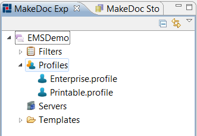

# Working with Profiles {#workingWithProfile .concept}

Chapter describes working with Profiles. Two Profiles are created automatically. Profiles allow:

-   start documentation process
-   set output format - HTML, PDF, DOCX
-   set paper format
-   set filter
-   set Storage setting - Storage, Repository location
-   Servers to document

-   **[Creating EMS Profiles](../../../../modules/pigeon/setup/dialogs/creatingProfile.md)**  

-   **[Editing EMS Profiles](../../../../modules/pigeon/setup/dialogs/editingProfile.md)**  

**Parent topic:**[Dialogs](../../../../modules/pigeon/setup/dialogs/dialogs.md)

