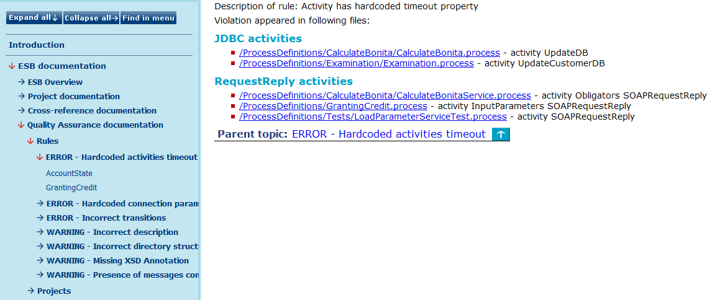

# Quality Assurance over Rules {#BaseModule .concept}

Chapter describes contents of generated output within the Quality Assurance module from the point of view of rules. This menu item provides you a view of violations over concrete rules sorted by its severity alphabetically. Once you expand a rule menu item the list of objects violated this concrete rule appears. The big advantage of this view is that you can click on the hyperlinked paths of objects \(violators\) and you are able to move to the violator very simple and very quickly.

**Parent topic:**[Generated Output](../../../modules/qa/output/index.md)

