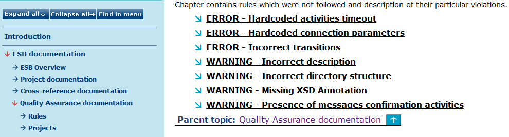

# Generated Output {#BaseModule .concept}

Chapter describes contents of generated Quality Assurance analysis output. The Quality Assurance output is divided to three parts:

-   List of violated rules
-   List of projects violated at least one rule
-   QA statistics

-   **[Quality Assurance over Rules](../../../modules/qa/output/QAOverRules.md)**  

-   **[Quality Assurance over Projects](../../../modules/qa/output/QAOverProjects.md)**  

-   **[Quality Assurance Stattistics](../../../modules/qa/output/QAStatistics.md)**  

**Parent topic:**[Quality Assurance](../../../modules/qa/index.md)

