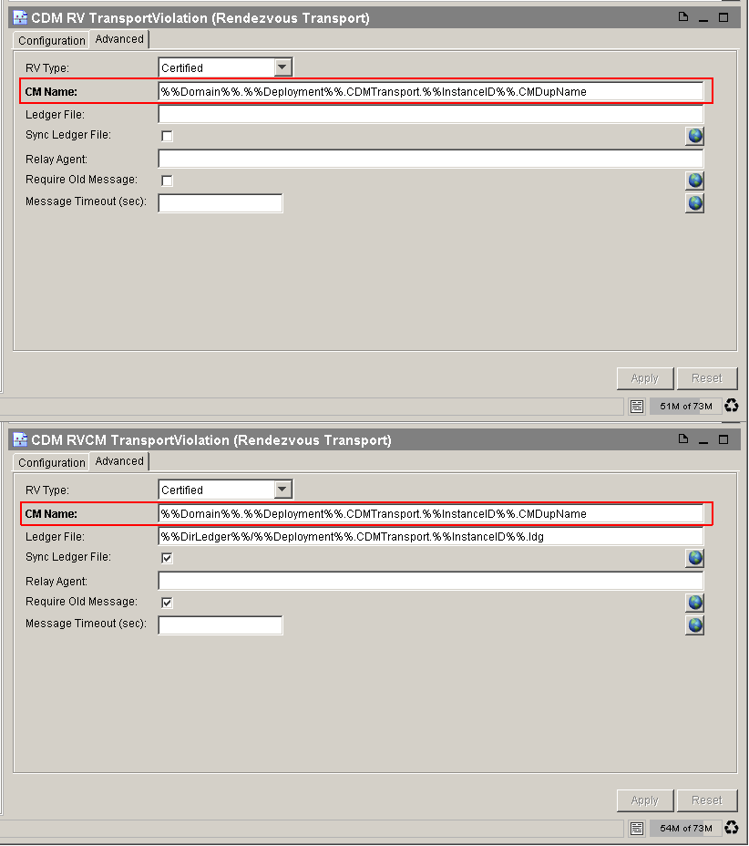

# CMNameConflictRuleChecker {#CMNameConflictRuleChecker .concept}

Groups of preconfigured CMNameConflictRuleChecker types of rules with instance distinction and violation description:

-   **Multiple CM names** - CM name conflicted
    -   RV Transports

This type of rule allows to check whether RV activities with same CM name exist in project. Example in picture above shows these two items with the same CM names filled in.

If checkByRvNetwork in Configuration section is set to true, conflicts are solved for each RV network separately, otherwise all transports are checked together and are considered to belong to the same network.

**Parent topic:**[Rule types description](../../../modules/qa/setup/qualityAssuranceRuleTypesDescription.md)

