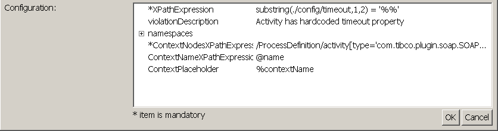

# ContextXPathRuleChecker {#ContextXPathRuleChecker .concept}

Groups of preconfigured ContextXPathRuleChecker types of rules with instance distinction and violation description:

-   **Incorrect description** - Item doesn't contain any description or description too short
    -   Starter activity, activities
-   **Hardcoded activities timeout** - Activity has hardcoded timeout property
    -   JDBC activities
    -   RequestReply activities
-   **Hardcoded endpoints** - Activity has hardcoded endpoint URL
    -   SOAP activities
    -   HTTP SendRequest activities
-   **Unused ADB Adapter** - Activity references ADB Adapter service
    -   ADB activities

This type of rule allows to create XPath expression which is used to check settings of items in one global context - for example settings of activities in process. Example in picture above shows hardcoded timeout property of SOAP Request Reply activity. Violation will be discovered if XPath expression is evaluated to false.

In configuration section concrete XPath expression used in context can be specified. There's also need to specify the context itself - it can be done by filling ContextNodeXPathExpression. For distinction of text output of discovered violation, there's also possible to set context placeholder, which can be used in Mask section of Rule Settings dialog, and it's value is specified by result of evaluation of ContextNameXPathExpression field of configuration section.

**Parent topic:**[Rule types description](../../../modules/qa/setup/qualityAssuranceRuleTypesDescription.md)

