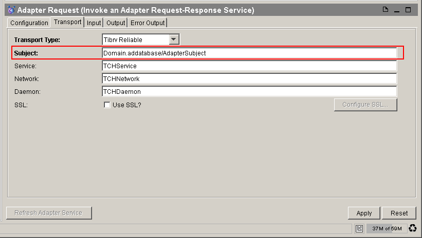

# DestinationFormatRuleChecker {#DestinationFormatRuleChecker .concept}

Groups of preconfigured DestinationFormatRuleChecker types of rules with instance distinction and violation description:

-   **Hardcoded or incorrect format of destination name** - Destination names are hardcoded or do not fulfill given regular expressions
    -   JMS destination activities
    -   RV destination activities
    -   Ada transport destination activities

This type of rule allows to check whether destination names in activities are hardcoded \(without using global variables\) or if it's name suits specified regex expression. Example in picture above shows hardcoded name of subject in Invoke an Adapter Request-Response Service.

In configuration section is possible to choose from three types of activities which will be checked - JMS, RV or Ada - and also specify regex expression for the format of name of these destinations.

**Parent topic:**[Rule types description](../../../modules/qa/setup/qualityAssuranceRuleTypesDescription.md)

