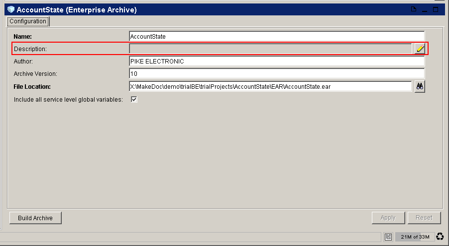

# XPathRuleChecker {#XPathRuleChecker .concept}

Groups of preconfigured XPathRuleChecker types of rules with instance distinction and violation description:

-   **Incorrect description** - Item doesn't contain any description or description too short
    -   Processes, AE Schemas, Archives, WSDLs, RV Transports, Shared JDBC Connections, HTTP Proxies, Shared HTTP Connections, Shared FTP Connections, Shared iProcess Connections, Shared Variables, Job Shared Variables, Service Agents, Concepts, Concept Views, Events, Channels, RuleSets, RuleFunctions, Scorecards, Shared JNDI Configs, Shared JMS Connections, BusinessConnect Connections
-   **Presence of process label** - Process has label
    -   Processes
-   **Missing archive signature** - Enterprise archive has no signature
    -   Archives
-   **Missing EAR signature** - EAR file has no signature
    -   EARs
-   **Hardcoded connection parameters** - Hardcoded connection
    -   JDBC connections
    -   JMS connections
    -   JNDI connections
    -   HTTP connections
    -   FTP connections
-   **Missing XSD annotation** - Process doesn't contain any XSD annotation
    -   XSDs
-   **Missing response activity** - Process has starter activity, but has no adequate response activity
    -   HTTP response activities
    -   SOAP response activities

This type of rule allows to create XPath expression which is used to check TIBCO resources \(xml files\). Violation will be discovered if this expression is evaluated to false. Example in picture above shows description of archive which isn't filled in.

In configuration section of [Rule Settings dialog](qualityAssuranceDialogRuleSettings.md) is possible to set XPath expression, which will be evaluated and also description of this particular violation.

**Parent topic:**[Rule types description](../../../modules/qa/setup/qualityAssuranceRuleTypesDescription.md)

