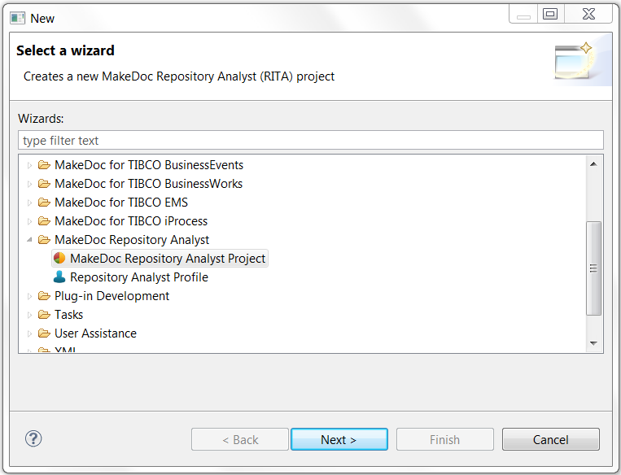
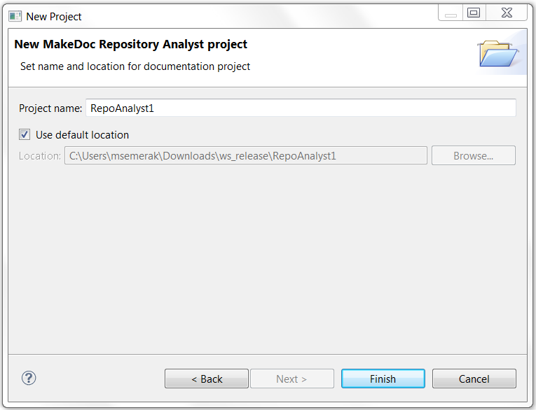
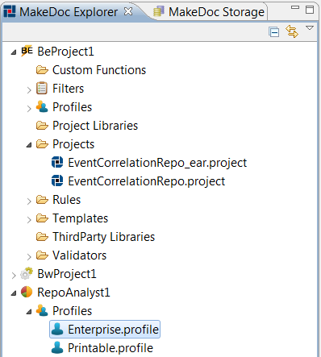

# Creating Repository Analyst Module Project {#creatingBEModulProject .concept}

Chapter describes creation of Repository Analyst Module project.

Name of project can be set in next wizard page.

MakeDoc creates main project structure after pressing Finish.

Project contains one folder:

-   Profiles - contains profiles for selecting Repository Analyst project to document, output format of documentation and selecting input data.

**Parent topic:**[Dialogs](../../../../modules/rita/setup/dialogs/dialogs.md)

