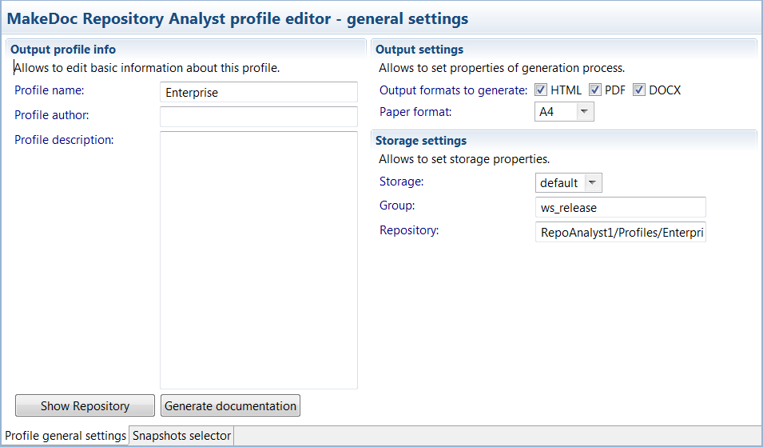
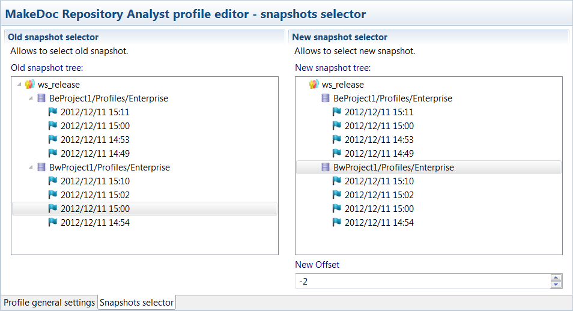

# Editing Repository Analyst Profiles {#editingBEProfile .concept}

Existing Repository Analyst Profiles can be modified by Repository Analyst Profile Editor. Double click on Repository Analyst Profile opens Repository Analyst Profile Editor.

Repository Analyst Profile Editor contains two bookmarks.

First bookmark Profile general settings allows set Profile name, which is showed in generated documentation name. Profile author says who creates Profile. Project description contains short information about Profile.

Output settings allows to set properties of generation process such as output formats to generate and paper format.

Last Storage settings allow to set storage properties as Storage and Repository location.

Button Generate documentation starts documentation process.

In second bookmark it's possible to select old and new Snapshots. These Snapshots are stored in Storage and this bookmark represents view into Repository. Selection of concrete Snapshot is possible in two ways. First way represents select of Repository and offset number specification. Offset is negative number which represents index in Repository, sorted from new Snapshot to older Snapshot. Zero number in offset means current Snapshot. Second way is to select concrete Snapshot in tree \(offset is set automatically\). In picture old Snapshot is selected by second way and new Snapshot by first one.

**Parent topic:**[Working with Profiles](../../../../modules/rita/setup/dialogs/workingWithProfile.md)

