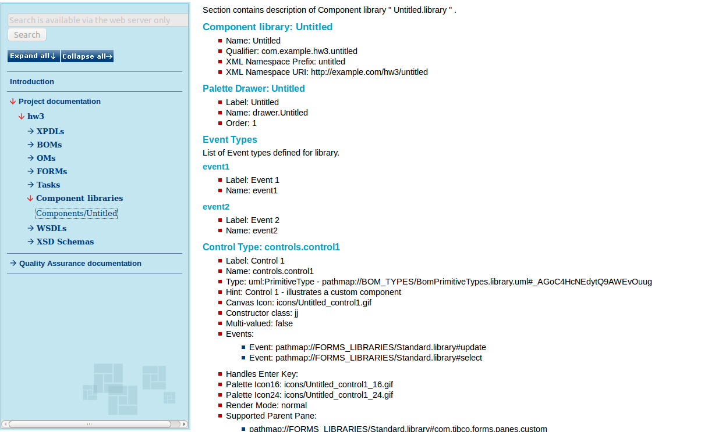

# Component libraries {#ComponentLibraries .concept}

Component library documentation consists of Component library content.

**Parent topic:**[Project Documentation](../../../modules/titanis/output/projectDocDetailBS.md)

