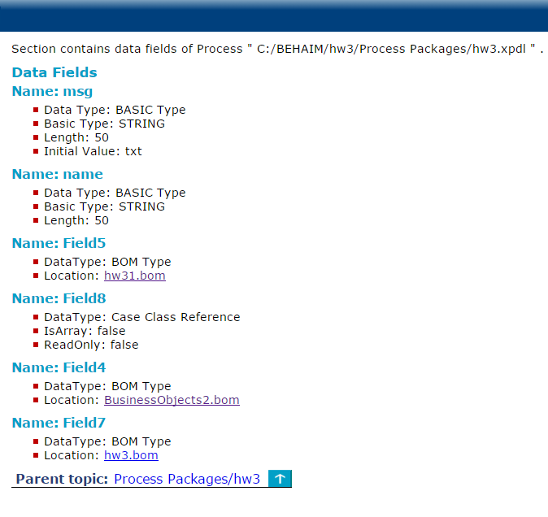

# Data Fields {#dataFields .concept}

Data Fields documentation consists of detailed information about data fields.

**Parent topic:**[Process Packages](../../../modules/titanis/output/processPackages.md)

