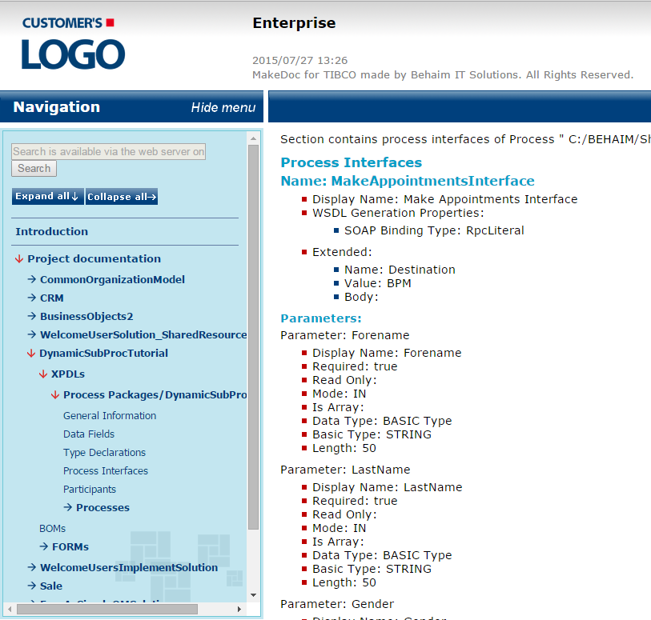

# Process Interfaces {#processInterfaces .concept}

Process Interface documentation consists of Intermediate Events, Parameters, Start Events.

**Parent topic:**[Process Packages](../../../modules/titanis/output/processPackages.md)

