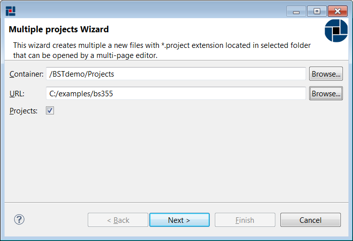

# Creating TIBCO Business Studio project {#creatingBSProject .concept}

TIBCO Business Studio project can be created by Multiple Business Studio Projects wizard. Multiple Business Studio wizard allows create more TIBCO Business Studio projects by one step.

**Creating multiple Business Studio projects**

Right click on Project folder in TIBCO Business Studio Module project and select New \> Business Studio Project

Multiple Business Studio Projects wizard allows selection of desired type of source - Folders. After setting URL to directory, wizard tries to find all sources in selected folder recursively and shows all found TIBCO Business Studio Projects for selecting or deselecting found projects.

**Parent topic:**[Working with TIBCO Business Studio projects](../../../../modules/titanis/setup/dialogs/workingWithBSProject.md)

