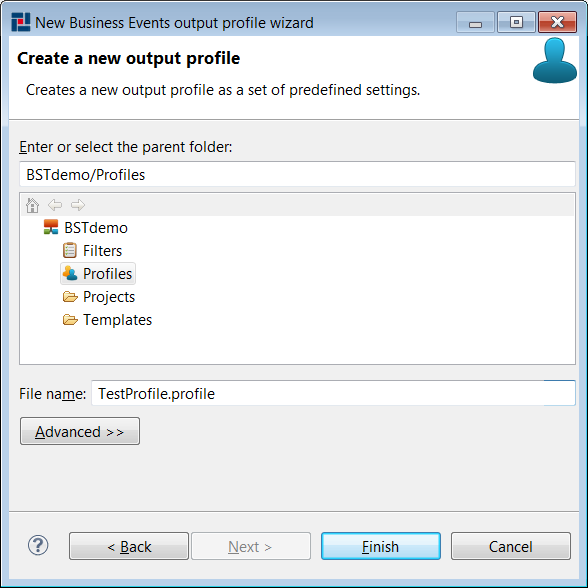

# Creating Business Studio Profiles {#creatingBSProfile .concept}

Business Studio Profiles can be created by Business Studio Profile wizard. To open Business Studio Profile wizard right-click on folder Profiles and select New \> Business Studio Profile.

First page allow select predefined type of Profile:

-   Enterprise - in default generates all outputs
-   Printable - in default generates only PDF output
-   QA Only - in default generates only QA output

On next page is possible select destination folder of created Profile and set name of new Profile.

Wizard creates new Profile in selected folder after pressing Finish button.

**Parent topic:**[Working with Profiles](../../../../modules/titanis/setup/dialogs/workingWithProfile.md)

