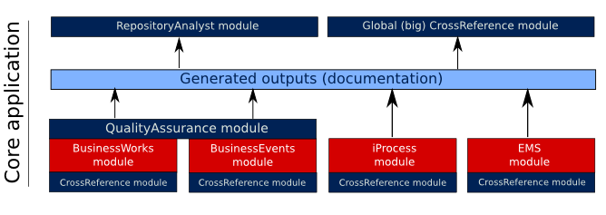

# Core application {#architecture_core .concept}

MakeDoc core application is modular application based on Eclipse platform. It means MakeDoc core application is set of Eclipse plugins together with basic Eclipse platform plugins. This plugins set encapsulates ability to generate documentation and perform analyses of source data. When deployed as server, it is invoked by MakeDoc plugin for Jenkins CI.

MakeDoc core application includes documentation modules for

-   TIBCO **[BusinessWorks](../core/documentation_modules/bw/bw.md)**
-   TIBCO **[BusinessEvents](../core/documentation_modules/be/be.md)**
-   TIBCO **[iProcess](../core/documentation_modules/ip/ip.md)**
-   TIBCO **[EnterpriseMessageService](../core/documentation_modules/ems/ems.md)**

and analytical modules

-   **[CrossReference](../core/analytical_modules/cross.md)** - analyses dependencies in TIBCO integration environment
-   **[Repository analyst](../core/analytical_modules/ra.md)** - highlights changes made in time to reduce time needed to solve problems
-   **[QualityAssurance](../core/analytical_modules/qa.md)** - static analysis of source code, based on extendable set of rules

**Parent topic:**[Architecture](../architecture/architecture.md)

