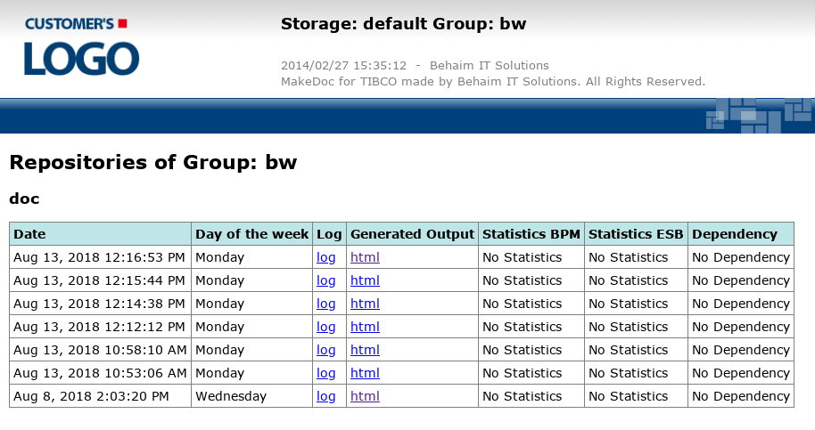

# Portal {#architecture_portal .concept}

[MakeDoc portal](../portal/portal.md) is dynamically generated website which allows users simply access generated documentation. Portal access can be authenticad via LDAP if needed. Following picture shows browsing through generated documentation snapshots.

**Parent topic:**[Architecture](../architecture/architecture.md)

