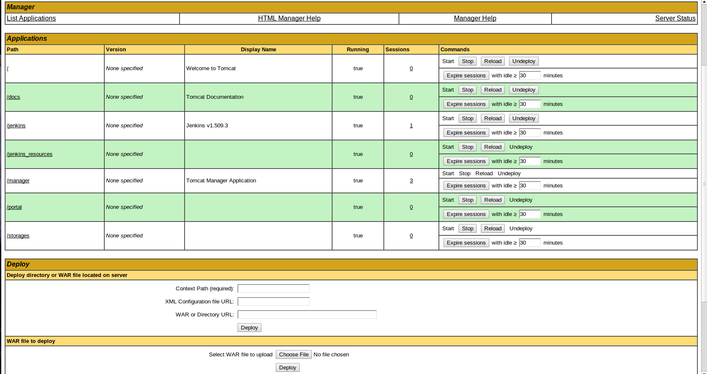

# Tomcat servlet container {#architecture_tomcat .concept}

Tomcat is used as container for server components Jenkins CI - customized by MakeDoc plugin - and MakeDoc portal. Tomcat runs on both platforms GNU/Linux and Microsoft Windows which are supported by MakeDoc Server edition.

Tomcat was adopted as universal solution for deploying MakeDoc server side components because of:

-   easy installation on both Linux and Windows
-   intuitive interface for deploying and managing applications
-   authentication via LDAP
-   SSL support

Figure shows Tomcat application manager interface with deployed [Jenkins CI](../jenkins/jenkins.md) and [MakeDoc portal](../portal/portal.md).

**Parent topic:**[Architecture](../architecture/architecture.md)

