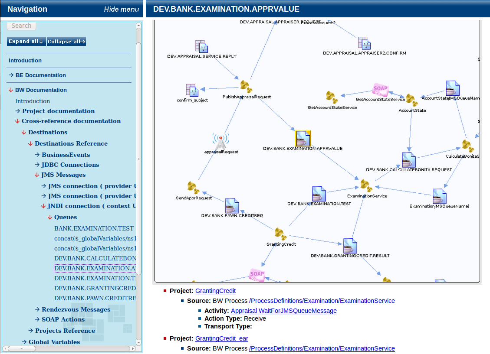
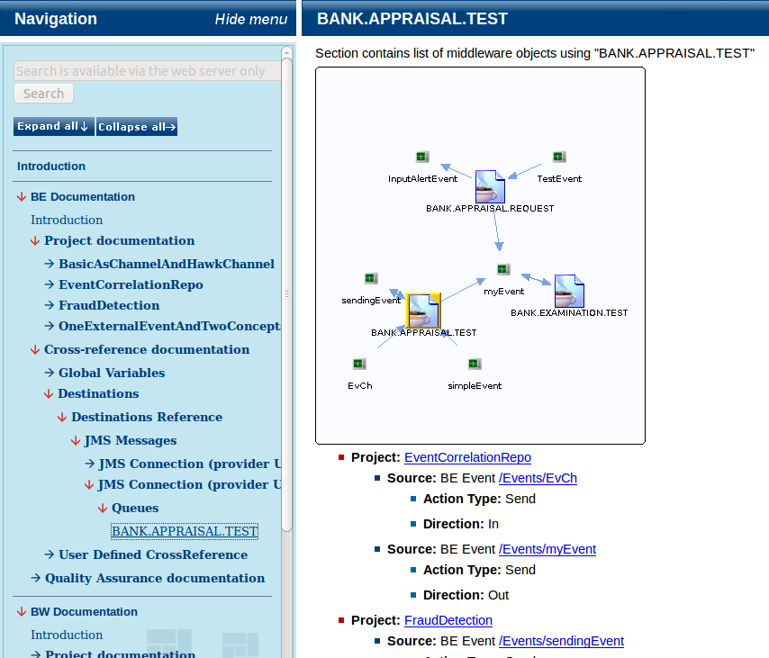
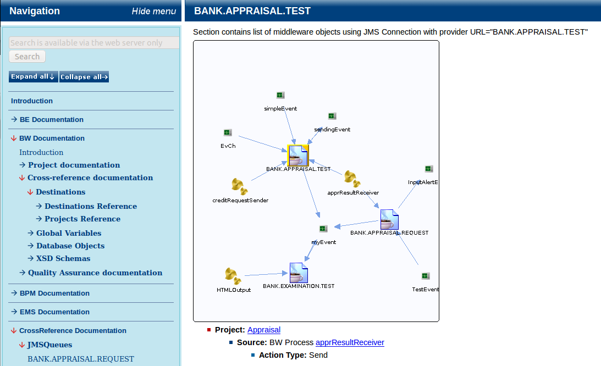

# CrossReference {#analytical_crossref .concept}

CrossReference is one of analytical modules available in MakeDoc. CrossReference provides complex overview of how the whole middleware works. In fact there are two types of CrossReference.

-   **Small CrossReference**: shows relations between projects of the same TIBCO product \(eg. BW to BW\) via used destinations \(JMS Queues, RV transports, ...\)
-   **Big CrossReference**: the same for various TIBCO products \(eg. BW to BE\)

CrossReference page destination consist of:

-   **dependencies visualisation in graph** - destinations are clickable, allows jump from one destination to another
-   **list of objects using this destination**

**Parent topic:**[Analytical modules](../../core/analytical_modules/analytical_modules.md)

