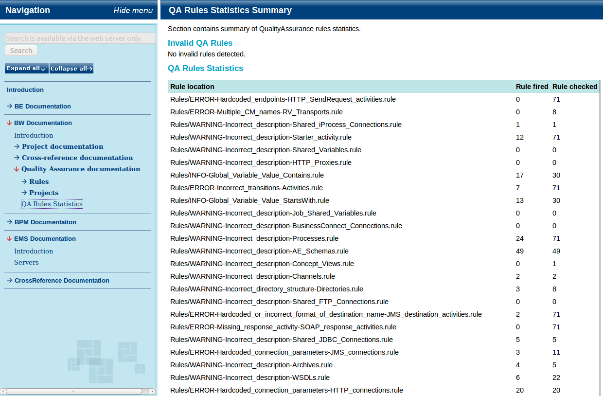

# QualityAssurance {#analytical_qa .concept}

QualityAssurance module checks source code against set of rules. User can create his own ruleset. Rules are based on XPath 2.0.

**Parent topic:**[Analytical modules](../../core/analytical_modules/analytical_modules.md)

