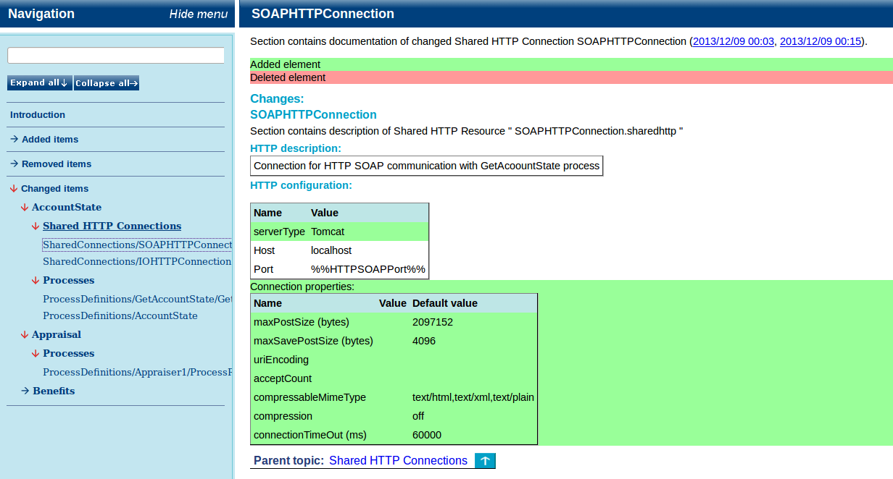
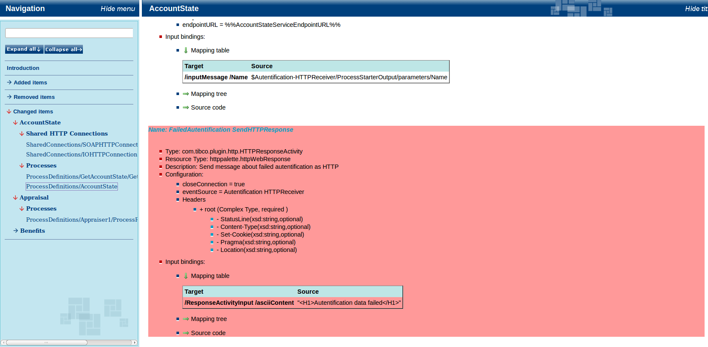

# RepositoryAnalyst {#analytical_repoanalyst .concept}

**RepositoryAnalyst module** compares two generated documentation snapshots and highlights changes between them.

This comparison significantly reduces time needed for problem source identification and helps to minimalize impacts of service unavailability.

**Parent topic:**[Analytical modules](../../core/analytical_modules/analytical_modules.md)

