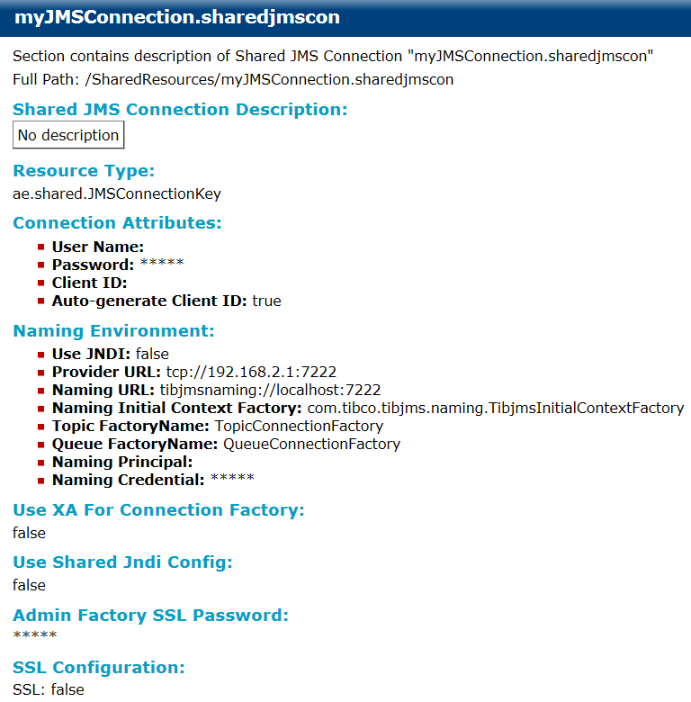

# Shared JMS Connection {#sharedJMSConnection .concept}

Shared JMS Connection documentation consists of Shared JMS Connection Description, Resource Type, Connection Attributes, Naming Environment, Connection factory, Shared JNDI Config, Admin Factory SSL Password and SSL Configuration.

**Parent topic:**[BusinessEvents](../../../core/documentation_modules/be/be.md)

