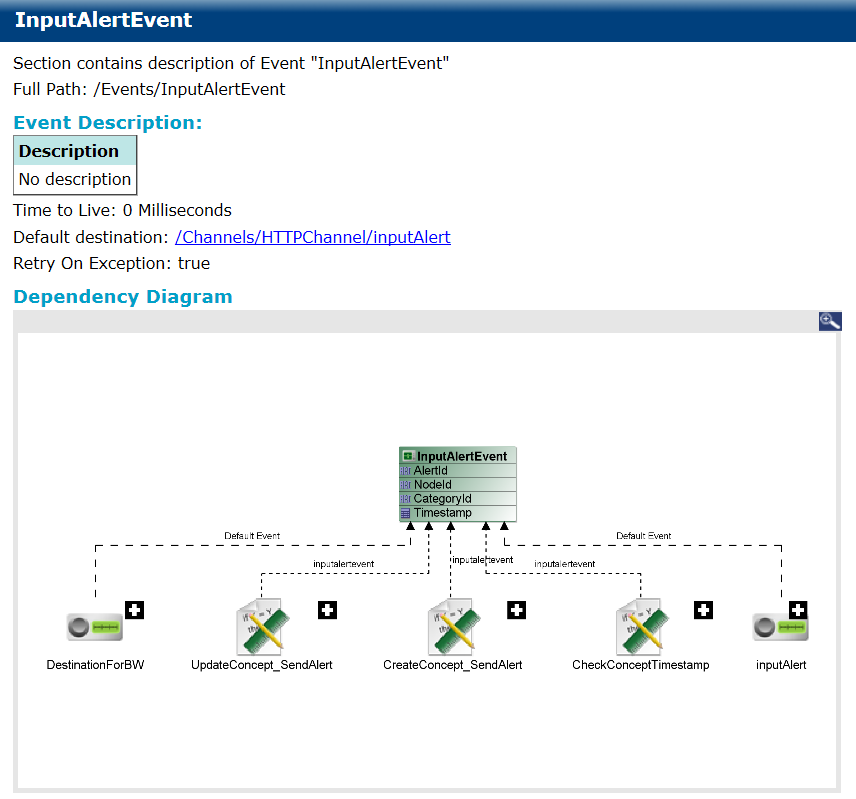
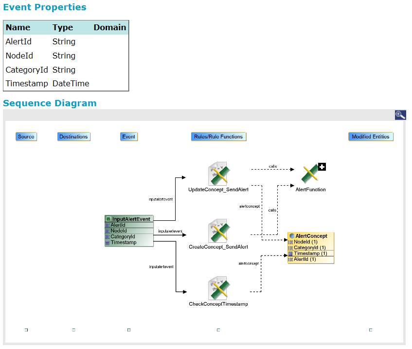

# Simple Events {#simpleEvent .concept}

Simple Event documentation consists of Event Description, Dependency Diagram, Event Properties, Sequence Diagram, Expiry Action, Payload String.

**Parent topic:**[BusinessEvents](../../../core/documentation_modules/be/be.md)

