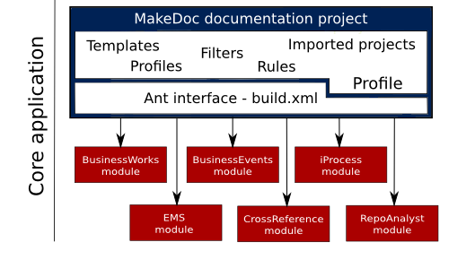

# Build {#md_build .concept}

Each MakeDoc documentation project includes build file named *build.xml*. This file is Ant build file, source for Apache Ant - documentation run director or we can say orchestrator. MakeDoc server starts documentation process by calling this file and passing profile as parameter via MakeDoc build step, see Build steps, MakeDoc specific build step and MakeDoc documentation job worklow.

Following picture shows the documentation process from core application point of view.

**Parent topic:**[MakeDoc project structure](../../core/makedoc_project_structure/md_project_structure.md)

