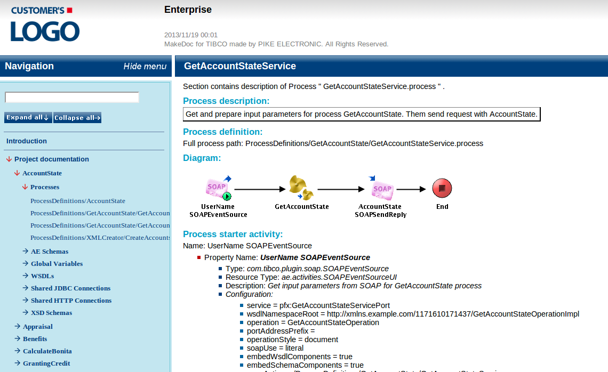
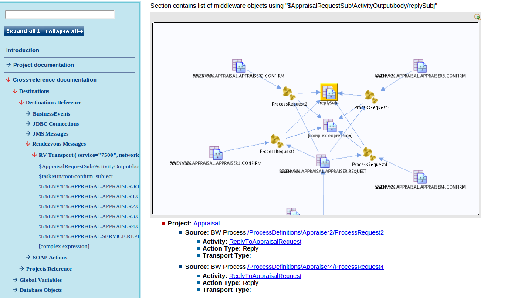
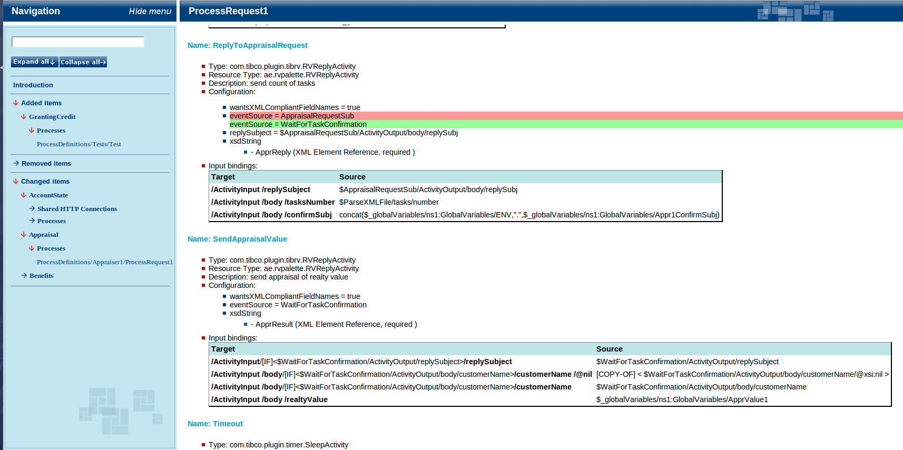

# Features and benefits {#features_benefits .concept}

MakeDoc Server is powerful solution for automatically generated documentation and *continuous* TIBCO integration environments monitoring.

MakeDoc server offers set of modules. These modules are of two basic categories.

-   [documentation modules](../core/documentation_modules/documentation_modules.md) for *[TIBCO BusinessWorks](../core/documentation_modules/bw/bw.md), [TIBCO BusinessEvents](../core/documentation_modules/be/be.md), [TIBCO EnterpriseMessageService](../core/documentation_modules/ems/ems.md) and [TIBCO iProcess](../core/documentation_modules/ip/ip.md)*
-   [analytical modules](../core/analytical_modules/analytical_modules.md) - *[CrossReference](../core/analytical_modules/cross.md), QualityAssurance, [RepositoryAnalyst](../core/analytical_modules/ra.md)*

Following pictures show briefly MakeDoc functionality.

[Documentation modules](../core/documentation_modules/documentation_modules.md) provide functionality for automatically generated documentation on daily basis.

[CrossReference module](../core/analytical_modules/cross.md) shows dependencies between projects. For instance if one BW process uses specific destination \(eg. JMS queue\) as well as BW process in another project, MakeDoc shows this dependency in graph. If for instance BW process uses the same destination as BusinessEvents event, MakeDoc binds them too.

[RepositoryAnalyst module](../core/analytical_modules/ra.md) analyses changes between generated documentation snapshots and reduces time needed to identify source of problem.

QualityAssurance module checks source code to detect various errors or potential sources of problems.

