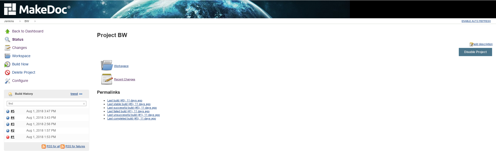
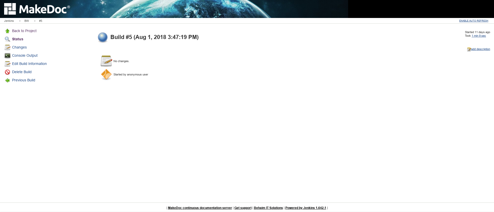
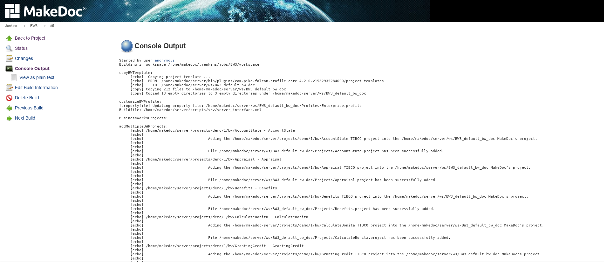

# Basics {#jenkins .concept}

**MakeDoc server** is based on **Jenkins Continuous integration** server. Basically it is software designed to support continuous integration well known in software development.

The central point of MakeDoc server is **Dasboard**.

On the dashboard there are displayed some **jobs**. Job simply does something based on it's configuration.

Clicking on the name of the job we can go to **Job Dashboard** where we can find information and controls related to this specific job. Most important are:

-   **Build now** - button used to trigger new build of the job
-   **Build history** - summarizes job builds performed in the past

Timestamps brings us to information about specific run of the job.

Here we can explore logs produced by the job during the run using **Console output**.

**Parent topic:**[Jenkins](../jenkins/jenkins.md)

