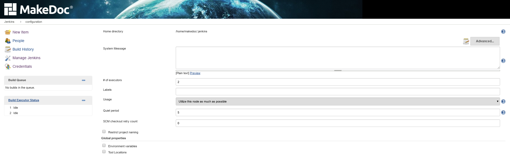
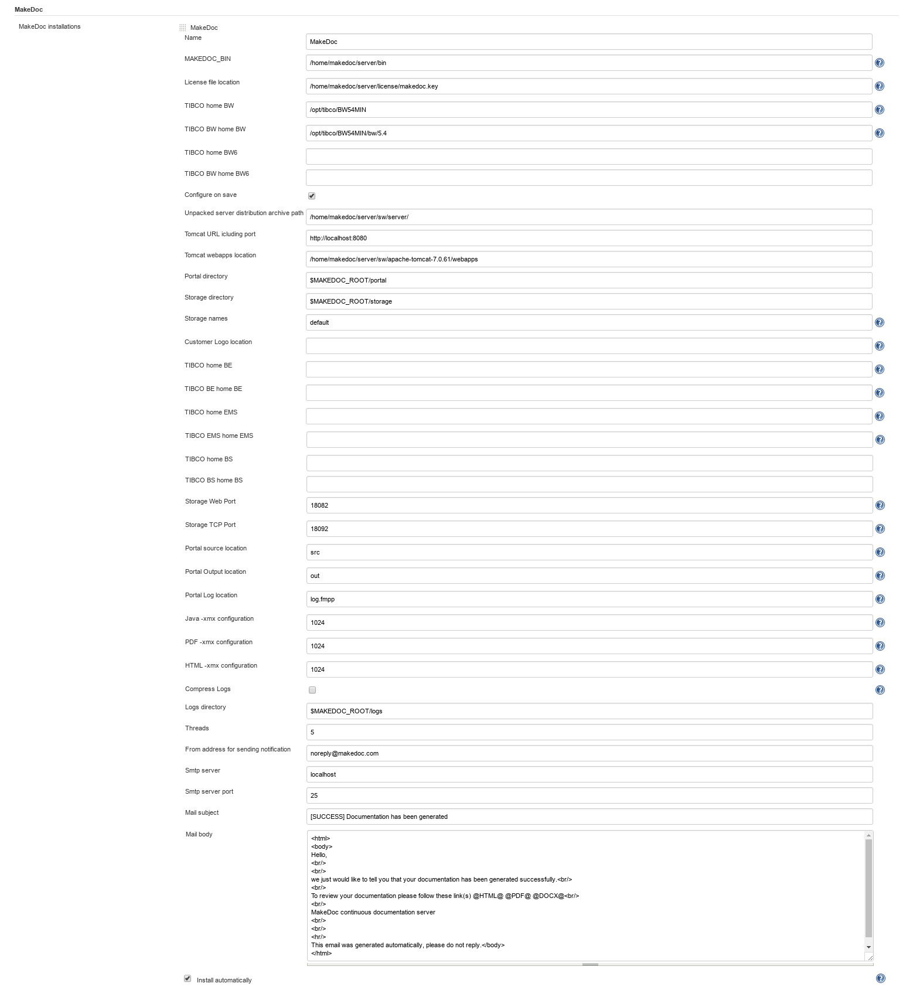
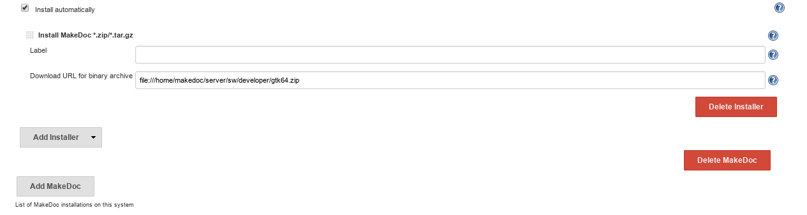
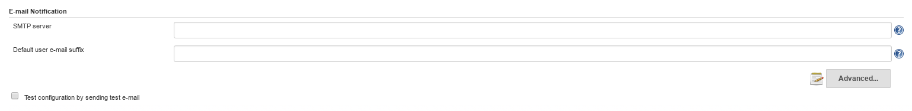

# General configuration {#general_configuration .concept}

Main server configuration can be found in **Manage Jenkins -\> Configure system.** Set of configurable values depends on installed plugins. This chapter describes most important options.

There are two types of configuration sections:

-   **General** - not depend on installed plugins
-   **Plugins related config values** - depend on installed plugins
    -   **Tools related config values** - configuration values for tools working under MakeDoc server, one of them is MakeDoc core application

Notice: from MakeDoc server point of view MakeDoc core application is simply tool which is called when some job needs to use it \(there is MakeDoc build step configured\). Other tools can be for example git, svn, ant, maven etc.

General configuration:

-   **Home directory:** directory containing all settings related to server, core application configuration directory is located in $MAKEDOC\_ROOT/cfg
-   **System message:** message displayed on Main dashboard \(supports HTML tags\), useful for link to portal or some important administration messages for other users
-   **\# of executors:** number of jobs that can run simultaneously
-   **SCM check retry count:** number of attempts to connect to VCS if first attempt failed

MakeDoc configuration:

These configuration values are used to configure MakeDoc core application via Server.

-   **Name:** name used to identify MakeDoc core application when creating MakeDoc step
-   **MAKEDOC\_BIN:** path to MakeDoc core application binaries, BIN parent directory is MAKEDOC\_ROOT
-   **Licence file location:** usually $MAKEDOC\_ROOT/license
-   **Configure on save:** true/false, transfer configuration to core application on Save.
-   **Portal directory:** MakeDoc portal default location, usually $MAKEDOC\_ROOT/portal
-   **Storage directory:** location where generated outputs are stored, usually $MAKEDOC\_ROOT/storage
-   **Storage names:** used to add/delete storages, string with storage names, separator is space
-   **Customer logo location:** path to customer logo displayed in generated documentation
-   **TIBCO HOME BW:** TIBCO BusinessWorks home \(eg. /opt/tibco\)
-   **TIBCO BW HOME BW:** path to TIBCO BusinessWorks version directory \(eg. /opt/tibco/bw/5.11\)
-   **TIBCO HOME BE:** TIBCO BusinessEvents home \(eg. /opt/tibco\)
-   **TIBCO BE HOME BE:** path to TIBCO BusinessEvents version directory \(eg. /opt/tibco/be/5.1\)
-   **TIBCO HOME EMS:** TIBCO EnterpriseMessage service home \(eg. /opt/tibco\)
-   **TIBCO EMS HOME EMS:** path to TIBCO EnterpriseMessageService version directory \(eg. /opt/tibco/ems/7.0\)
-   **Storage Web Port:** storage database port, default is 18082
-   **Storage TCP Port:** storage database port, default is 18092
-   **Portal source location:** directory containing MakeDoc portal templates, default is $MAKEDOC\_ROOT/portal/src
-   **Portal output location:** direcotry containing latest MakeDoc portal, default is $MAKEDOC\_ROOT/portal/out
-   **Portal log location:** path to MakeDoc portal log
-   **Java -xmx configuration:** amount of memory available for DITA files generation, default 1024
-   **PDF -xmx configuration:** amount of memory available for PDF, default 1024
-   **MD -xmx configuration:** amount of memory available for Markdown, default 1024
-   **HTML -xmx configuration:** amount of memory available for HTML, default 1024
-   **Compress logs:** used to control if compress log after generation process finishes or not
-   **Logs directory:** main directory for logs
-   **Threads:** number of threads used to generate BW documentation DITA files, default is 2\*\(\# of CPU\) +1

MakeDoc core application is installed from defined location when MakeDoc core binaries are not found.

MakeDoc server sends email notifications when build fails if configured to do so.

**Parent topic:**[Jenkins](../jenkins/jenkins.md)

