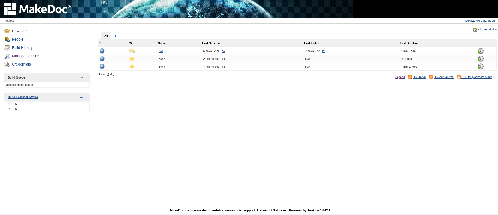

# Jenkins {#jenkins .concept}

Jenkins CI enhanced with MakeDoc plugin together with MakeDoc portal creates web-based MakeDoc server user interface.

MakeDoc server funcionality includes:

-   comfortable interface for documentation jobs design
-   centralized documentation jobs progress monitoring
-   ability to fetch data from various directly supported Version Control Systems such as SVN or GIT
-   ability to fetch and document production deployments using TIBCO AppManage
-   ability to connect to almost all other data sources using generic scripting - Ant scripts, Bash scripts, Windows batch files etc. \(requires customization\)
-   ability to define post-build steps depending on job finish status
-   poweful scheduling of all common tasks to achieve continuous monitoring

-   **[Basics](../jenkins/basics.md)**  

-   **[General configuration](../jenkins/general_configuration.md)**  

-   **[Job anatomy](../jenkins/job_anatomy/job_anatomy.md)**  

-   **[MakeDoc build steps](../jenkins/md_build_steps/md_build_steps.md)**  

-   **[Advanced](../jenkins/advanced/advanced.md)**  

