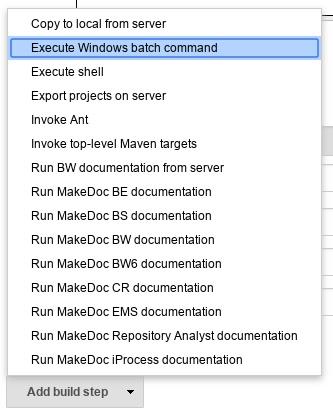
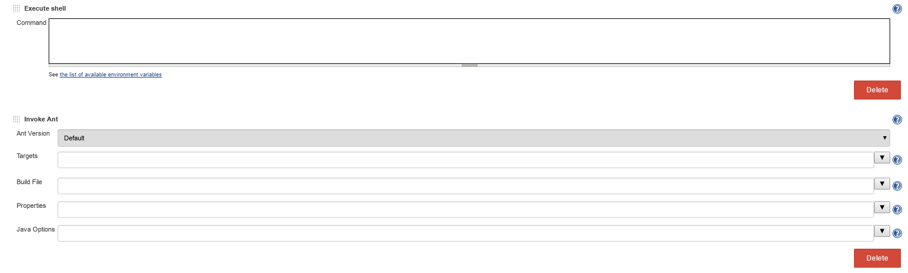

# Build steps {#build_steps .concept}

Each executional job part consist of Build steps. There are two kinds of build steps available in MakeDoc server.

-   **Generic Jenkins build steps** - designed to perform generic task such as calling scripts for instance *Execute Windows batch command* or *Execute shell*
-   **MakeDoc-specific build steps** - designed specially for MakeDoc, for instance *Run MakeDoc BW documentation*

Generic steps are useful when routines specific for certain customer environment need to be done earlier than MakeDoc documentation step\(s\) starts or after it finishes. In another words generic steps provide ability to customize MakeDoc server to fit customer needs.

Available generic build steps \(related to software build process automation\):

-   **Execute windows batch command** - Windows specific
-   **Execute shell** - Linux specific
-   **Execute top-level Maven targets** - multiplatform
-   **Invoke Ant** - multiplatform

Useful for accessing specific data sources via it's CLI using custom script.

**Parent topic:**[Job anatomy](../../jenkins/job_anatomy/job_anatomy.md)

